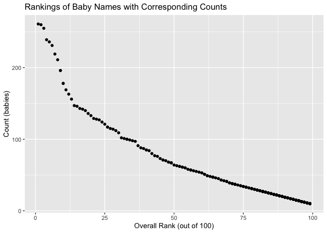

p8105\_hw2\_kd2524\_-for\_Jeff
================
October 4th, 2019

## GitHub Documents

This is an R Markdown format used for publishing markdown documents to
GitHub. When you click the **Knit** button all R code chunks are run and
a markdown file (.md) suitable for publishing to GitHub is generated.

## Including Code

You can include R code in the document as follows:

``` r
summary(cars)
```

    ##      speed           dist       
    ##  Min.   : 4.0   Min.   :  2.00  
    ##  1st Qu.:12.0   1st Qu.: 26.00  
    ##  Median :15.0   Median : 36.00  
    ##  Mean   :15.4   Mean   : 42.98  
    ##  3rd Qu.:19.0   3rd Qu.: 56.00  
    ##  Max.   :25.0   Max.   :120.00

## Including Plots

You can also embed plots, for example:

<!-- -->

Note that the `echo = FALSE` parameter was added to the code chunk to
prevent printing of the R code that generated the plot.

\#\#Problem 1: Actions are followed by code chunks

*Actions: -Read and cleaned the Mr. Trash Wheel sheet (used updated
dataset\_ Fall 2019) -Specified the sheet in the Excel file and omitted
non-data entries (rows with notes / figures; columns containing notes)
using arguments in read\_excel -Used reasonable variable names -Omitted
rows that do not include dumpster-specific data -Rounded the number of
sports balls to the nearest integer and converted the result to an
integer variable (using as.integer).*

  - Code
        Chunk\*
    
    ``` r
    library(tidyverse)
    ```
    
        ## Warning in as.POSIXlt.POSIXct(Sys.time()): unknown timezone 'zone/tz/2019c.
        ## 1.0/zoneinfo/America/New_York'
    
        ## ── Attaching packages ───────────────────────────────────────────────── tidyverse 1.2.1 ──
    
        ## ✔ ggplot2 3.2.1     ✔ purrr   0.3.2
        ## ✔ tibble  2.1.3     ✔ dplyr   0.8.3
        ## ✔ tidyr   1.0.0     ✔ stringr 1.4.0
        ## ✔ readr   1.1.1     ✔ forcats 0.4.0
    
        ## ── Conflicts ──────────────────────────────────────────────────── tidyverse_conflicts() ──
        ## ✖ dplyr::filter() masks stats::filter()
        ## ✖ dplyr::lag()    masks stats::lag()
    
    ``` r
    library(readxl)
    mr_trash_wheel_df = 
    readxl::read_excel("./Data/Trash-Wheel-Collection-Totals-8-6-19.xlsx", sheet = 1,range = "A2:N408") %>%
    janitor::clean_names() %>%
    mutate(sports_balls = as.integer(round(sports_balls))) %>%
    drop_na()
    ```

*Actions -Read and cleaned precipitation data for 2017 -Read and cleaned
precipitation data for 2018 -Merge the two precipitation datasets*

*Code Chunk*

``` r
precipitation_2017 = 
  readxl::read_excel("./Data/Trash-Wheel-Collection-Totals-8-6-19.xlsx", sheet =6, range = "A2:B14") %>%
  janitor::clean_names() %>%
  mutate(year = 2017) %>%
  drop_na()

precipitation_2018 = 
  readxl::read_excel("./Data/Trash-Wheel-Collection-Totals-8-6-19.xlsx", sheet =5, range = "A2:B14") %>%
  janitor::clean_names() %>%
  mutate(year = 2018) %>%
  drop_na()

precipitation_2017_2018 = 
  bind_rows(precipitation_2017, precipitation_2018) %>%
  mutate("month" = month.name[as.integer(month)])

sum_2018 = filter(precipitation_2017_2018, year == 2018)
median_2017 = filter(mr_trash_wheel_df, year == 2017)
```

*Summary* The Mr Trash Wheel data has 344 observations. The
Precipitation data from years 2017 and 2018 has 24 observations. The key
variables for the Mr. Trash Wheel sheet are: weight (tons), volume
(cubic yards), plastic bottles (number of), polysterene (number
of),cigarette butts (number of), and grocery bags(number of),chip bags
(number of) sports balls (number of), homes powered (number of). The key
variables for each of the precipitation sheets include the total amount
of precipitation (inches) per month, for the specific year (i.e., 2017,
2018 etc.). For the combined datasheet persipitation\_2017-2018 we can
compute the mean of total percipitation in inches which is: 4.3025
inches. From the available data the total precipitation in 2018 is:
70.33 inches.The median number of sports balls per dumpster in 2017 was
8 balls.

## Problem 2: Actions are followed by code chunks

*Action: Cleaned the data in pols-month.csv.*

*Code Chunk*

``` r
pols_month = read_csv(file = "./Data/pols-month.csv") %>%
  janitor::clean_names() %>%
  separate(col = mon, into = c("year", "month", "day"), sep = "-") %>%
  mutate(month = month.name[as.numeric(month)]) %>% 
  mutate(president = if_else(prez_gop == 1, "gop", "dem")) %>% 
  select(-prez_gop, -prez_dem, -day)
```

*Action:Cleaned the data in snap-csv.*

*Code Chunk*

``` r
snp_month = read_csv(file = "./Data/snp.csv") %>% 
  janitor::clean_names() %>%
  separate(col = date, into = c("month", "day", "year"), sep = "/") %>% 
  select("year", "month", "day", "close") %>% 
  mutate(month = month.name[as.numeric(month)]) %>% 
  select(-day) %>% 
  rename(snp_close = close)
```

*Action:Cleaned the data from unemployment.csv, and Switching “wide” to
“long” format; ensuring that key variables have the same name; and
ensuring that key variables take the same values.*

*Code Chunk*

``` r
library(tidyverse)
unemployment_month = read_csv(file = "./Data/unemployment.csv") %>% 
  janitor::clean_names() %>% 
  mutate(year = as.character(year))%>%
pivot_longer(jan:dec, names_to = "month", values_to = "percent_unempl") %>% 
  mutate(month = case_when(
    month == "jan" ~ "January",
    month == "feb" ~ "February",
    month == "mar" ~ "March",
    month == "apr" ~ "April",
    month == "may" ~ "May",
    month == "jun" ~ "June",
    month == "jul" ~ "July",
    month == "aug" ~ "August",
    month == "sep" ~ "September",
    month == "oct" ~ "October",
    month == "nov" ~ "November",
    month == "dec" ~ "December"
  ))
```

\*Action: Merge the snp and pols datasets into snp\_pols and then merge
this with unemployment dataset into one final file
named:snp\_pols\_unemployment.

*Code Chunk*

``` r
snp_pols = 
  left_join(snp_month, pols_month, by = c("year", "month"))
snp_pols_unemployment = 
  left_join(snp_pols, unemployment_month, by = c("year", "month"))
```

*Summary* *The final comprehensive datafile snp\_pols\_unemployment, was
created by merging the tidied datasets of pols\_month, snp\_month, and
unemployment\_month by dates. The dataset pols\_month included the
counts (by month and year) for the national politicians of each party
from January 1947 to June 2015. It included information about the
president being a GOP representative or DEM representative. The snp
dataset included the closing values of the S\&P stock market
index(arranges by date) from January 1950 to July 2015. The snp data is
missing between 1947-1949 (otherwise complete). The unemployment dataset
contained the % unemployment (by month and year) from January 1948 to
December 2015. The unemployment data is missing for 1947 (otherwise
complete) The Final merged file included 822 observations and 11
variables. *

## Problem 3:Actions are followed by code chunks

*Action: Read and cleaned the Popular Baby Names dataset*

*Code chunk*

``` r
library(tidyverse)
popular_baby_names = read.csv(file = "./Data/Popular_Baby_Names.csv") %>% 
  janitor::clean_names() %>% 
  rename(name = child_s_first_name) %>% 
  rename(year = year_of_birth) %>% 
  mutate(name = tolower(name)) %>% 
  mutate(gender = tolower(gender)) %>% 
  mutate(ethnicity = tolower(ethnicity)) %>% 
  mutate(ethnicity = case_when(
    ethnicity == "asian and pacific islander" ~ "Asian and Pacific Islander",
    ethnicity == "asian and paci" ~ "Asian and Pacific Islander",
    ethnicity == "black non hispanic" ~ "Black Non-Hispanic",
    ethnicity == "black non hisp" ~ "Black Non-Hispanic",
    ethnicity == "white non hispanic" ~ "White Non-Hispanic",
    ethnicity == "white non hisp" ~ "White Non-Hispanic",
    ethnicity == "hispanic" ~ "Hispanic"
  )) %>% 
  distinct()
```

*Action: Created a table demonstrating the rank of popularity of the
name “Olivia” over time*

*Code chunk*

``` r
olivia_name = popular_baby_names %>% 
  select(year, ethnicity, name, rank) %>% 
  filter(name == "olivia")
```

  - Action: For the rank popularity of the “Olivia” name over time I
    have developed a reader friendly table that provides rows for
    ethnicities and columns for year.\*

*Code Chunk*

``` r
olivia_rank =
  pivot_wider(olivia_name,
    names_from = "year",
    values_from = "rank") %>% 
  select(-name) %>% 
  select ("ethnicity", "2011", "2012", "2013", "2014", "2015", "2016")
```

*Action: Produced a similar table showing the most popular name among
male children over time* *Code Chunk*

``` r
boy_names = popular_baby_names %>% 
  select(year, name, gender, ethnicity, rank) %>% 
  filter(gender == "male")
```

*Action: Transformed the above table to become more visually friendly
and reflect the ranking by year (in columns)*

*code Chunk*

``` r
boy_names_rank =
  pivot_wider(
    boy_names,
    names_from = "year",
    values_from = "rank"
  ) %>% 
  select(-gender) %>% 
  select ("name", "ethnicity", "2011", "2012", "2013", "2014", "2015", "2016")
```

*Action: For male, white non-hispanic children born in 2016, produced a
scatter plot showing the number of children with a name (y axis) against
the rank in popularity of that name (x axis).* *Code Chunk*

``` r
boy_wnh_2016 = popular_baby_names %>% 
  filter(
    year == "2016",
    gender == "male",
    ethnicity == "White Non-Hispanic"
         ) %>% 
  select(-year, -gender, -ethnicity)
ggplot(boy_wnh_2016, aes(x = rank, y = count)) + 
  geom_point() +
labs(
    title = "Rankings of Baby Names with Corresponding Counts",
    x = "Overall Rank (out of 100)",
    y = "Count (babies)"
  )
```

<!-- -->
